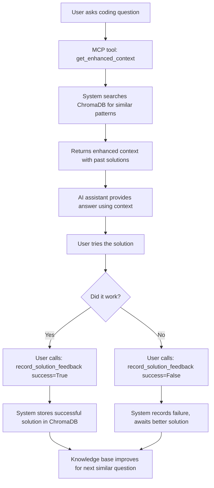

# How Adaptive RAG Learns from Users

## 🔄 Learning Pathway 1: Interactive Feedback Learning

### **The Complete Cycle:**



### **Step-by-Step Example:**

#### **Step 1: User asks question**
```python
# Via MCP tool call
enhanced_context = get_enhanced_context(
    query="How do I fix 'TypeError: list indices must be integers' in Python?",
    tool="claude_desktop",
    user_id="developer_123"
)
```

#### **Step 2: System searches and provides context**
```python
# Returns enhanced context like:
{
    "query": "How do I fix 'TypeError: list indices must be integers' in Python?",
    "has_similar_patterns": True,
    "suggested_context": """Based on a similar problem (similarity: 0.89, success rate: 92%):
    - Past successful approach: Check if you're using a string index instead of integer. 
      Convert with int() or use enumerate() for string-integer pairs.
    
    Here is the user's question, please use this context to provide a better answer:
    ---
    How do I fix 'TypeError: list indices must be integers' in Python?""",
    "pattern_id": 1247,  # For feedback tracking
    "similar_patterns": [...]
}
```

#### **Step 3: User tries solution and provides feedback**
```python
# If solution worked:
feedback_result = record_solution_feedback(
    pattern_id=1247,
    query="How do I fix 'TypeError: list indices must be integers' in Python?",
    solution_approach="The issue was using string keys on a list. Changed my_list['key'] to my_list[0] and it worked perfectly.",
    success=True
)

# Returns:
{
    "status": "Feedback recorded successfully", 
    "learned": True,  # System stored this solution in ChromaDB
    "pattern_id": 1247
}
```

#### **Step 4: Knowledge base improves**
- ✅ Solution stored in ChromaDB with embeddings
- ✅ Success rate updated (e.g., 92% → 93%)
- ✅ Pattern metadata enhanced
- ✅ Next similar question gets even better context

---

## 📚 Learning Pathway 2: Bulk Knowledge Ingestion

### **Option A: Using Your Own Code Repositories**

Create a custom ingestion script for your codebase:

```python
# custom_ingestion.py
import os
import sqlite3
from datetime import datetime
import hashlib
import chromadb
from chromadb.utils import embedding_functions
import git
from pathlib import Path

def ingest_repository(repo_path: str, description: str = "Custom repository"):
    """Ingest your own code repository into the RAG system"""
    
    # Connect to existing RAG system
    chroma_client = chromadb.PersistentClient(path="chroma_db_gte")
    gte_ef = embedding_functions.SentenceTransformerEmbeddingFunction(
        model_name="thenlper/gte-large"
    )
    collection = chroma_client.get_or_create_collection(
        name="adaptive_rag_patterns_gte",
        embedding_function=gte_ef
    )
    
    # Walk through your code files
    for file_path in Path(repo_path).rglob("*.py"):  # Adjust extensions as needed
        try:
            with open(file_path, 'r', encoding='utf-8') as f:
                code_content = f.read()
            
            # Extract meaningful code patterns
            if len(code_content) > 100:  # Skip tiny files
                # Create synthetic "question-answer" pairs from your code
                relative_path = file_path.relative_to(repo_path)
                
                # Example: Extract functions and their docstrings
                import ast
                tree = ast.parse(code_content)
                
                for node in ast.walk(tree):
                    if isinstance(node, ast.FunctionDef) and ast.get_docstring(node):
                        func_name = node.name
                        docstring = ast.get_docstring(node)
                        
                        # Get function source
                        func_source = ast.get_source_segment(code_content, node)
                        
                        # Create a "query" from the docstring/function name
                        synthetic_query = f"How to implement {func_name}: {docstring}"
                        
                        # Store as proven solution
                        store_custom_pattern(
                            query=synthetic_query,
                            solution=func_source,
                            language="python",
                            source=f"{description}: {relative_path}",
                            collection=collection
                        )
                        
        except Exception as e:
            print(f"Error processing {file_path}: {e}")

def store_custom_pattern(query: str, solution: str, language: str, source: str, collection):
    """Store a custom pattern in the knowledge base"""
    
    # Create pattern features
    pattern_hash = hashlib.md5(f"custom:{language}:{query}".encode()).hexdigest()[:16]
    
    # Store in SQLite
    with sqlite3.connect('adaptive_rag.db', timeout=10) as conn:
        c = conn.cursor()
        c.execute('''INSERT OR REPLACE INTO patterns 
                     (pattern_hash, query_type, language, pattern_text, solution_approach, 
                      success_count, failure_count, avg_success_rate, created_at, updated_at) 
                     VALUES (?, ?, ?, ?, ?, ?, ?, ?, ?, ?)''',
                  (pattern_hash, "custom", language, query[:100], solution[:500], 
                   1, 0, 1.0, datetime.now(), datetime.now()))
        
        pattern_id = c.lastrowid or c.execute('SELECT id FROM patterns WHERE pattern_hash = ?', 
                                             (pattern_hash,)).fetchone()[0]
    
    # Store in ChromaDB
    doc_id = f"custom_pattern_{pattern_id}"
    metadata = {
        "pattern_hash": pattern_hash,
        "query_type": "custom",
        "language": language,
        "pattern_text": query[:100],
        "avg_success_rate": 1.0,
        "success_count": 1,
        "failure_count": 0,
        "source": source
    }
    
    collection.upsert(
        ids=[doc_id],
        documents=[solution],
        metadatas=[metadata]
    )
    
    print(f"Stored: {query[:50]}...")

# Usage:
if __name__ == "__main__":
    # Ingest your own repositories
    ingest_repository("/path/to/your/project", "My Company Backend")
    ingest_repository("/path/to/your/scripts", "My Automation Scripts")
```

### **Option B: Feeding Custom Q&A Pairs**

```python
# custom_qa_ingestion.py
def ingest_qa_pairs(qa_pairs: list):
    """Ingest custom question-answer pairs"""
    
    for qa in qa_pairs:
        query = qa["question"]
        solution = qa["answer"]
        language = qa.get("language", "general")
        success_rate = qa.get("success_rate", 1.0)
        
        store_custom_pattern(query, solution, language, "Custom Q&A", collection)

# Example usage:
custom_knowledge = [
    {
        "question": "How do we handle database migrations in our Django project?",
        "answer": "Use our custom migration script: python manage.py migrate_with_backup --check-constraints",
        "language": "python",
        "success_rate": 0.95
    },
    {
        "question": "What's the company standard for error handling in React?",
        "answer": "Use our ErrorBoundary component and log to Sentry with context: <ErrorBoundary><YourComponent /></ErrorBoundary>",
        "language": "javascript", 
        "success_rate": 0.98
    },
    {
        "question": "How to deploy to our Kubernetes cluster?",
        "answer": "Use kubectl apply -f deployment.yaml after updating the image tag in values.yaml",
        "language": "general",
        "success_rate": 0.92
    }
]

ingest_qa_pairs(custom_knowledge)
```

### **Option C: Learning from Documentation**

```python
# doc_ingestion.py
def ingest_documentation(doc_folder: str):
    """Ingest markdown documentation as knowledge"""
    
    for md_file in Path(doc_folder).rglob("*.md"):
        with open(md_file, 'r') as f:
            content = f.read()
        
        # Parse markdown sections
        sections = content.split('## ')
        
        for section in sections[1:]:  # Skip first empty split
            lines = section.split('\n')
            title = lines[0].strip()
            body = '\n'.join(lines[1:]).strip()
            
            if len(body) > 50:  # Skip tiny sections
                query = f"How to {title.lower()}?"
                store_custom_pattern(query, body, "documentation", 
                                   f"Docs: {md_file.name}", collection)

# Usage:
ingest_documentation("/path/to/your/docs")
```

---

## 🎯 **User Interaction Examples**

### **Example 1: Learning from Success**
```
User: "How do I handle authentication in our API?"
Assistant: [Gets context, provides answer based on past patterns]
User tries solution → It works!
User: record_solution_feedback(pattern_id=123, success=True, 
      solution_approach="Used JWT tokens with our custom middleware")
→ System learns this approach works for authentication questions
```

### **Example 2: Learning from Failure**
```
User: "How do I optimize this slow query?"
Assistant: [Provides answer based on existing patterns]
User tries solution → Doesn't work for their specific case
User: record_solution_feedback(pattern_id=456, success=False)
→ System notes this pattern needs improvement
→ When user later provides working solution, it gets higher weight
```

### **Example 3: Company-Specific Knowledge**
```python
# Add your company's specific patterns
custom_patterns = [
    {
        "question": "How do we handle user permissions?",
        "answer": "Use our Permission mixin: class MyView(PermissionMixin, View): required_permissions = ['can_edit']",
        "language": "python"
    }
]
# This becomes available to all team members using the system
```

---

## 🔍 **Monitoring Learning Progress**

### **Check what the system has learned:**
```python
# Get comprehensive stats
stats = get_system_statistics()
print(f"Learned {stats.learned_vectors} solutions from {stats.total_patterns} patterns")

# Check specific language knowledge
python_knowledge = get_language_knowledge("python")
print(python_knowledge)  # Shows top patterns for Python

# View dashboard
dashboard = get_dashboard()  # Real-time learning progress
```

### **Track learning effectiveness:**
```python
# The system tracks:
# - Success rates by pattern type
# - Most effective solutions
# - Language-specific performance
# - User feedback quality
```

---

## 💡 **Best Practices for Feeding the System**

### **For Interactive Learning:**
1. **Always provide feedback** - Both positive and negative
2. **Be specific in solutions** - "Used X approach because Y"
3. **Include context** - What specific error/situation
4. **Update when solutions change** - New better approaches

### **For Bulk Ingestion:**
1. **Quality over quantity** - Curate good examples
2. **Include failure cases** - What doesn't work and why
3. **Company-specific patterns** - Your unique approaches
4. **Regular updates** - Keep knowledge current

### **Data Sources to Consider:**
- ✅ Your code repositories
- ✅ Internal documentation  
- ✅ Successful bug fixes from tickets
- ✅ Code review comments and improvements
- ✅ Team knowledge sharing sessions
- ✅ Stack Overflow answers that worked for you
- ✅ Company coding standards and patterns

The system becomes more valuable as it learns your team's specific approaches and successful patterns!